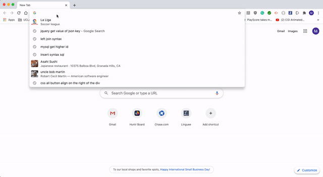

# Burger_tracker

Burger logger. Clients can input the burger they desire to eat. The burger will be placed as ready to eat. When the client has eaten the burger, the client can click a devour button and save the burger as eaten.

# Technologies Used

1. MySQL
2. Node.js
2. Express
3. Handlebars

# Table of Contents

* [Installation](#installation)
* [Instructions](#instructions)
* [Features](#features)
* [Example Gif](#example-gif)
* [Author](#author)

## Installation
> 1.npm init // 2.npm install mysql express express-handlebars

## Instructions
> Open your browser and go to [Burger logger](). Be creative. Choose the burger you want to eat and input the name on the input box. The burger will appear as ready on the box below in the browser. When you are done with your burger, click devour and the burger will be marked as so.

## Features
* CRUD method

## Example Gif

## Author 

**MikelTafalla**

Email: mikel362d@gmail.com

Location: Santa Barbara

GitHub: https://github.com/MikelTafalla

